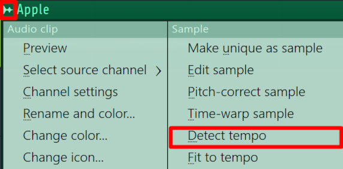
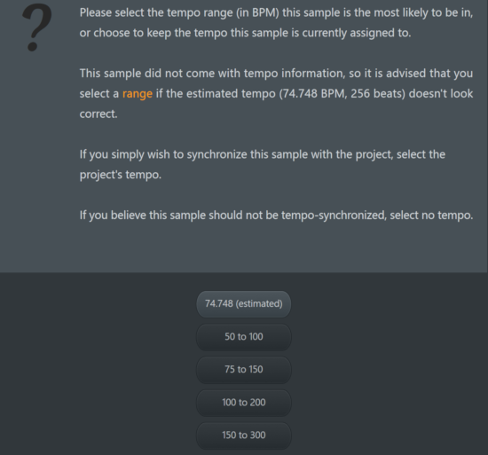
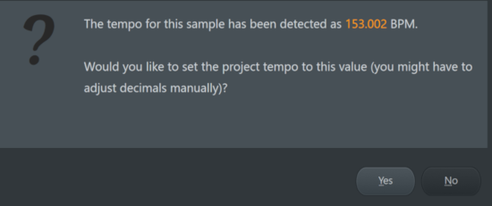
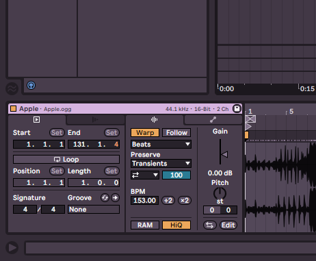

import ReactPlayer from 'react-player'

import {HeaderBadgesWidget} from '../../src/components/HeaderWidget.js';

# Finding the BPM of a song

## Introduction
BPM is the measurment of amount of beats per minute in a song, `120BPM` is 120 beats per minute, which is 2 beats per second.

Finding the BPM is really important to have a synced rhythm game chart in general, specially in a game like Rhythm Heaven where audio cues ***that have to fit the music*** are used instead of the usual Visual Reaction Game formula where you just see notes on the screen to click.

There's multiple ways you can find the BPM of a song, we'll go from the most common to least common.

## Tapping along
This is a really common and known method to find the BPM of a song, it's not always accurate, depending on your sense of rhythm of course.

In Heaven Studio finding the "Tapping along" option isn't hard, on the top left corner find the mouse icon next to the Music Selection icon.

A window will appear after you click the icon, you can click the icon in the window with the music to find the bpm.

This method isn't always recommended, because it depends on your sense of rhythm.

High chances, you'll get the BPM wrong, like this example here.

(Song is PinocchioP - Apple dot com)

<ReactPlayer controls url='/vid/bpm/tapalongwrong.mp4' />
  

After using one of the other methods, the correct BPM is`153BPM`

<ReactPlayer controls url='/vid/bpm/correctbpm.mp4' />

## Just look it up online
You can look up "`Song Name` BPM" on your favourite search engine, this may bring up either accurate results or far from accurate results.

Here are some websites that automatically check BPM of songs on Spotify:

- [Tunebat](https://tunebat.com)
- [SONG⚡BPM](https://songbpm.com/)
- [GetSongbpm](https://getsongbpm.com/)

Only one of these websites (Tunebat) had the correct BPM of the song used as an example previously, but you should always try all BPMs you find if you will go with this method.

## Using an online tool
There are multiple tools online to automatically check the BPM of a music file for you, this is probably the least accurate method you could use.

One of the tools used for that is [GetSongbpm's tool](https://getsongbpm.com/tools/audio), keep in mind it only works with the `mp3` format.

## Using a DAW
Most DAWs have a built-in tempo checker, they may be inaccurate sometimes, so a manual method will also be explained if needed, only Ableton and FL Studio will be covered here.

### FL Studio
#### Automatically
FL Studio comes with a somewhat good built-in automatic BPM checker, to access it click on the wave icon on the top left of the audio (next to the name of it) you have dragged to the timeline then click "Detect tempo".

A window will appear asking you to put in the BPM range of the audio file you are trying to detect BPM of, recommended ranges are `75BPM-150BPM` and `100BPM-200BPM`.

Using the song used above (PinocchioP - Apple dot com), FL Studio detected the tempo as `153.002BPM`, which is accurate, but we do not need the `.002BPM`.
Results may vary depending on the song, specially if it has BPM changes.

#### Manually

Adjusting the tempo manually starts pretty similarly to the automatic method. Just drag in an audio file.

Notice the peaks in the waveform? These are what we're going to use to find the tempo.

Parts of the waveform with little start-up or "attack" tend to be more accurate with this method, which are highlighted in green. The section highlighted in red has a lot more attack, so it has some ambiguity on where it starts.

The grid in most DAWs are divided up into beats. Once we align this audio file to that grid, it will be in tempo.

In order to do that, adjust the project bpm, which is listed on the top of the screen, until these peaks are situated on the lines of the grid. You might need to zoom in a bit to make sure it's situated just right.

This is why we wanted sections with little attack. The start of the section is more defined, making it easier to align.
Once each one of these sections is on the grid, you may need to adjust as you scroll through your song, your project bpm should be
the song's tempo.

### Ableton
#### Automatic
In Ableton Live 11, Ableton automatically detect the tempo of an audio file once it's inserted in the timeline.

To view the detected tempo click on the audio file after inserting it to the timeline.

#### Manual
Check the manual method in FL Studio right above, the method is similar.

## Checking charts from other rhythm games
There's ALWAYS an osu! chart for the song you are remixing.

Most rhythm games have the BPM accessible from the chart file they use, some games like osu! use milliseconds for beats instead of BPM, in which case you'd need to download the game and check in it's editor, this is the best method so far in my opinion.

## Checking a fandom wikia
This works like a charm, a lot of times.

A lot of fandom wikias contain the BPMs of popular songs from that fandom's media, this is your best option specially if you are going to remix a Vocaloid or a Touhou song.

<HeaderBadgesWidget commaDelimitedContributors="Saraistupid" lastDateString="2/12/23" />
